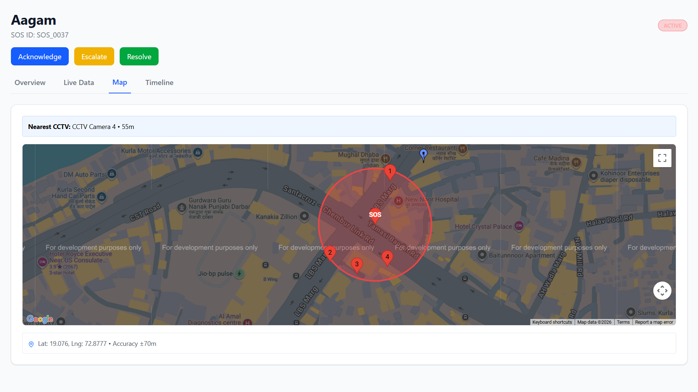
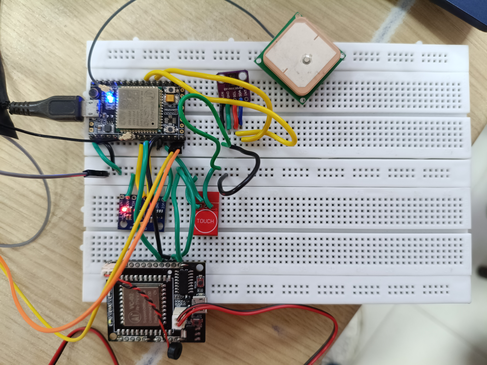
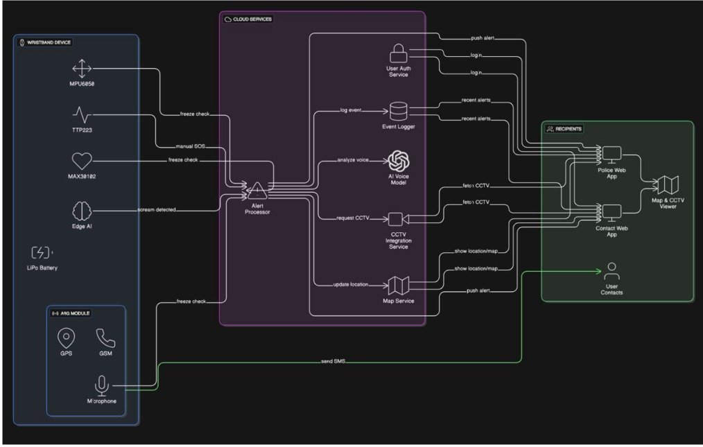

# 🛡️ Smart Safety Band

<div align="center">


**A wearable IoT-based safety device that detects emergencies via voice, heart rate & movement — and sends real-time SOS alerts with GPS location via GSM.**

<table>
  <tr>
    <td align="center"></td>
    <td align="center"></td>
  </tr>
  <tr>
    <td align="center"><em>Dashboard for officials showing location and important details</em></td>
    <td align="center"><em>Hardware showing the connections & modules used</em></td>
  </tr>
</table>

</div>

---
<div align="center">

## 👥 Team Members

| Name | SAP ID |
|---|---|
|&nbsp;&nbsp;&nbsp;&nbsp;&nbsp;&nbsp; **Aagam Shah** &nbsp;&nbsp;&nbsp;&nbsp;&nbsp;&nbsp; | &nbsp;&nbsp;&nbsp;&nbsp;&nbsp;&nbsp; 60004230125 &nbsp;&nbsp;&nbsp;&nbsp;&nbsp;&nbsp; |
| &nbsp;&nbsp;&nbsp;&nbsp;&nbsp;&nbsp; **Chaitanya Raut** &nbsp;&nbsp;&nbsp;&nbsp;&nbsp;&nbsp; | &nbsp;&nbsp;&nbsp;&nbsp;&nbsp;&nbsp; 60004230169 &nbsp;&nbsp;&nbsp;&nbsp;&nbsp;&nbsp; |
| &nbsp;&nbsp;&nbsp;&nbsp;&nbsp;&nbsp; **Cyrus Rumao** &nbsp;&nbsp;&nbsp;&nbsp;&nbsp;&nbsp;| &nbsp;&nbsp;&nbsp;&nbsp;&nbsp;&nbsp; 60004230214 &nbsp;&nbsp;&nbsp;&nbsp;&nbsp;&nbsp; |
| &nbsp;&nbsp;&nbsp;&nbsp;&nbsp;&nbsp; **Bhaumik Chavda** &nbsp;&nbsp;&nbsp;&nbsp;&nbsp;&nbsp; | &nbsp;&nbsp;&nbsp;&nbsp;&nbsp;&nbsp; 60004230235 &nbsp;&nbsp;&nbsp;&nbsp;&nbsp;&nbsp; |

</div>

## 📌 Problem Statement

Personal safety emergencies can happen in seconds and conventional solutions either rely on smartphones, require manual input, or fail to detect when a person is physically or mentally incapacitated. Panic situations like accidents, medical episodes, or threats can leave a person **unable to press a button or make a call**. There is a need for a smart wearable that can **autonomously detect distress** through multiple physiological and environmental signals and act without requiring any input from the user.

---

## 💡 Solution

The **Smart Safety Band** is an intelligent wearable IoT device that detects emergencies through **two independent sensing layers** — voice and touch to automatically triggers life-saving alerts:

- 🎙️ Detects spoken **voice commands** ("help", "emergency") via the VC-02 voice recognition module
- ❤️ Continuously monitors **heart rate** using the MAX30102 sensor and flags dangerous spikes
- 🏃 Tracks **body movement** using the MPU6050 accelerometer/gyroscope
- 🧠 **Freeze state detection** — if heart rate spikes AND no movement is detected simultaneously, the device identifies a psychological/physical freeze response
- 📳 Activates a **coin vibration motor** to alert and snap the person out of the freeze state
- 📍 Fetches **real-time GPS coordinates** and sends an emergency SMS with a Google Maps link
- 📞 Places an **automatic emergency call** to pre-registered contacts
- 🌐 Provides a **web dashboard** (frontend + backend) for live tracking and alert history for helping officials
- Operates **completely independently** of a smartphone using a SIM card + onboard GSM

---

## ⚙️ Tech Stack / Components Used

### 🔧 Hardware
| Component | Description |
|---|---|
| **A9G Module (Ai-Thinker)** | Quad-band GSM/GPRS + GPS/BDS all-in-one module |
| **VC-02 Voice Recognition Module** | Offline voice command detection — triggers on "help" / "emergency" |
| **MAX30102** | Heart rate & SpO2 sensor — detects pulse spikes indicating distress |
| **MPU6050** | 6-axis accelerometer + gyroscope — detects movement or lack thereof |
| **Coin Vibration Motor** | Haptic feedback to break freeze state when distress is detected |
| **SOS Push Button** | Manual emergency trigger as a backup input |
| **SIM Card** | Cellular connectivity for SMS and calls |
| **GPS & GSM Antennas** | External antennas for signal acquisition |

### 💻 Software & Firmware
| Technology | Usage |
|---|---|
| **MicroPython** | Core firmware running on the A9G/microcontroller (`hardware_combined_code.py`) |
| **Backend Server** | Receives GPS/alert data, manages contacts and event logs |
| **Frontend Web UI** | Live tracking dashboard for officials and emergency contacts |
| **Google Maps URL API** | Converts GPS coordinates to a shareable map link in SMS |

### 📡 Communication & Protocols
- **UART / Serial** — A9G module and VC-02 communication
- **I²C** — A9G MCU ↔ MAX30102 (heart rate) and MPU6050 (motion) sensors
- **GSM / GPRS** — SMS delivery and voice call initiation
- **GPS / BDS** — Satellite-based real-time positioning 
- **HTTP / REST API** — Backend ↔ Frontend data exchange

---

## 🔄 System Architecture & Flow

<div align="center">
  
  <br/>
  <em>System Architecture & Flow</em>
</div>

### 🧠 Freeze State Logic
```
IF  max30102.heart_rate > SPIKE_THRESHOLD
AND mpu6050.movement == STATIONARY
THEN
    → Trigger coin vibrator (haptic alert)
    → Flag as "Freeze State" in alert payload
    → Dispatch SOS with freeze state tag
```

**Sample SMS sent to emergency contacts:**
```
🚨 SOS ALERT! I need help.
My current location:
https://maps.google.com/?q=19.0760,72.8777
Status: Freeze state detected — HR spike, no movement.
Please respond immediately.
```

---

## 🎥 Demo Video

> 📹 **[Watch the Project Demo Here](https://youtu.be/YOUR_LINK_HERE)**
>
> *(Replace this with your YouTube / Google Drive demo video link before submitting)*

---

## 📟 Sensor & Module Reference

### MAX30102 — Heart Rate Sensor
| Parameter | Detail |
|---|---|
| Interface | I²C |
| Function | Measures BPM and SpO2 |
| Trigger Condition | BPM > configured spike threshold |

### MPU6050 — Motion Sensor
| Parameter | Detail |
|---|---|
| Interface | I²C |
| Function | 3-axis accelerometer + 3-axis gyroscope |
| Trigger Condition | Acceleration delta below movement threshold |

### VC-02 — Voice Recognition Module
| Command | Action |
|---|---|
| `"help"` | Triggers SOS alert flow |
| `"emergency"` | Triggers SOS alert flow |
| `"danger"` | Triggers SOS alert flow |
| `"save me"` | Triggers SOS alert flow |

### A9G — GSM/GPS Module (MicroPython)
| Function | MicroPython Method |
|---|---|
| Enable GPS | UART command to A9G |
| Get Coordinates | Get location via Satellite Co-ordinates|
| Send SMS | Write GSM send routine via UART |
| Make Call | Write dial routine via UART |
| Check Signal | Query A9G signal status |

---

<div align="center">
  Made with ❤️ by <strong>Team Smart Safety Band</strong><br/>
  Aagam Shah &nbsp;·&nbsp; Chaitanya Raut &nbsp;·&nbsp; Cyrus Rumao &nbsp;·&nbsp; Bhaumik Chavda
</div>
